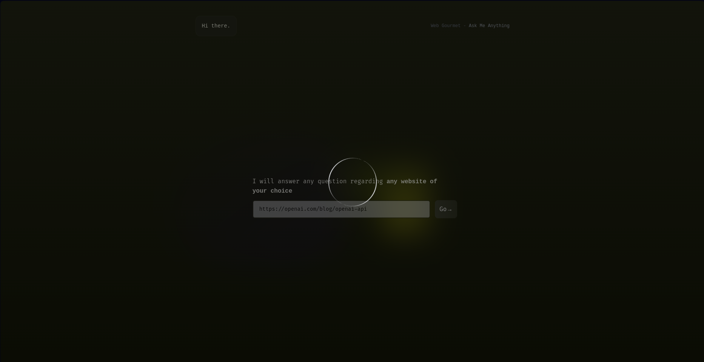

# Web Gourmet

# Description
Web Gourmet is a web application that allows users to input a website URL, then proceed to ask any questions they may
have about the website.
The application will then provide a response to the user's question. The application is built
using the Django framework and the Python programming language.
The application uses the BeautifulSoup library to scrape the website and extract the information needed to answer
the user's question. The application leverages the power of AI for the question-answering functionality.
The frontend application is built using Next.js and TypeScript.
This is achieved using the embedded-search capabilities of openAI's GPT models.

# Installation
View the installation instructions for the frontend and backend in their respective directories.

# Usage
View the usage instructions for the frontend and backend in their respective directories.

# Screenshots

|                                                                       |                                                                               |
|-----------------------------------------------------------------------|-------------------------------------------------------------------------------|
| landing screen             | Loading screen                  |
| entering a prompt screen  | Successful submission of URL  |
| Sample answers        | Sample answers                |
| Sample answers      |                                                                               |

# Contributing
View the contributing instructions for the frontend and backend in their respective directories.

# License
This project is licensed under the MIT license. See the [LICENSE](LICENSE) file for more details.
